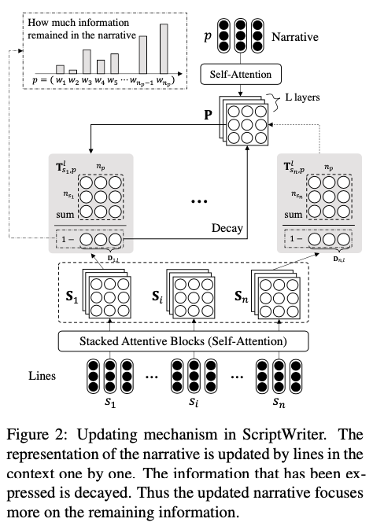
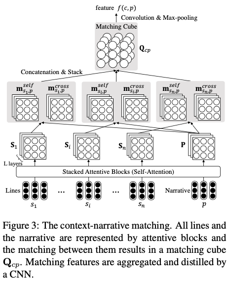

# ScriptWriter: Narrative-Guided Script Generation

This repository contains the source code and datasets for the ACL 2020 paper ScriptWriter: Narrative-Guided Script Generation by Zhu et al.  

## Model
### Updating Mechanism

### Context-Narrative Matching

Context-response matching and narrative-response matching are similar.
